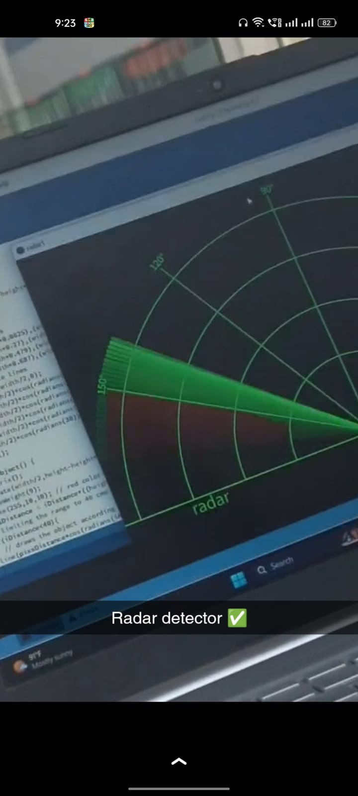

# ElectronicsProjects
Real-Time Electronics & Communication Engineering Projects with Arduino

---

# 🔭 Ultrasonic Radar Detection System

A real-time object detection system using an ultrasonic sensor and servo motor to simulate radar. It visualizes obstacles on a radar-like graphical interface using Processing.

## 🔧 Technologies Used
- **Arduino Uno**
- **HC-SR04 Ultrasonic Sensor**
- **Servo Motor (SG90)**
- **Processing (Java-based IDE for visual output)**

## 🧠 Project Description
This project simulates a radar system using Arduino. The ultrasonic sensor is mounted on a servo motor and scans from 0° to 180°. The distance data is sent to a Processing sketch, which displays it visually.

## 📌 Features
- Radar sweep simulation with servo motor
- Real-time distance scanning
- Visual representation using Processing
- Customizable scan angle and resolution

## ⚙️ How It Works
1. Servo rotates the sensor from 0° to 180°.
2. Ultrasonic sensor measures distance at each step.
3. Arduino sends the data to Processing via serial.
4. Processing renders a radar screen showing object positions.

## 🖥️ Circuit Diagram

## 📸 Screenshot

## 📂 Files
- `arduino code.txt` – Arduino sketch
- `processing code.txt` – Processing visualization script

## 🚀 Getting Started
1. Assemble the hardware as per the circuit diagram.
2. Upload the Arduino code.
3. Run the Processing sketch and select the correct serial port.

## 📎 License
This project is open-source and available under the MIT License.

---

# ⏱️ Smart Timer for Liquid Mosquito Repellent

An Arduino-based automation system to control the ON/OFF timing of liquid mosquito repellents using an RTC module.

## 🔧 Technologies Used
- **Arduino Uno**
- **RTC DS1307 (Real-Time Clock)**
- **Relay Module**
- **Buzzer**
- **Push Button**

## 🧠 Project Description
This smart timer automates the repellent’s operation by switching it ON and OFF at preset times using a real-time clock. It reduces power wastage and human effort.

## 📌 Features
- Automated switching based on real-time clock
- Relay module for AC device control
- Buzzer alerts on state change
- Manual control via push button

## ⚙️ How It Works
1. RTC keeps accurate time.
2. Arduino compares current time with ON/OFF schedule.
3. Relay switches the repellent ON/OFF.
4. Buzzer gives audible feedback at each transition.

## 🖥️ Circuit Diagram
> 

## 📸 Screenshots
> *(Add photos or serial monitor output if available)*

## 📂 Files
- `Smart_Timer_For_Liquid_Electronic_Mosquito_Repellents.ino` – Arduino sketch

## 🚀 Getting Started
1. Connect all components as shown in the circuit diagram.
2. Upload the sketch to Arduino.
3. Set ON/OFF times in the code and power up the system.

## 📝 Notes
- Ensure RTC is set correctly before use.
- Take precautions when using relay for AC devices.

## 📎 License
This project is open-source and available under the MIT License.

